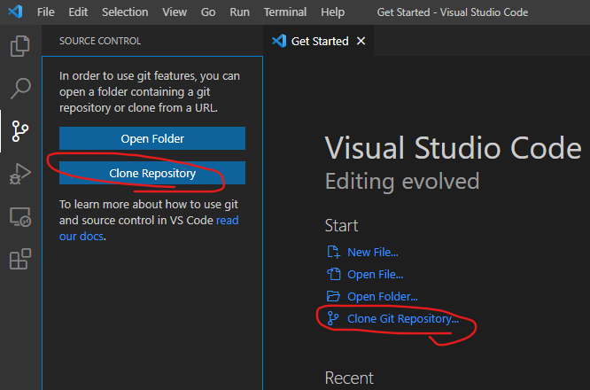
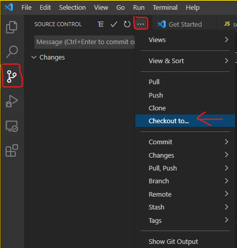
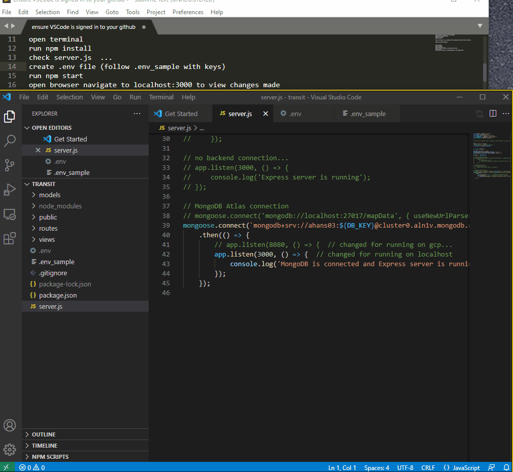

# TAMUSA NSF transit project

**Clone repository**: (easy VSCode method  ***just one of many ways***)

1. ensure VSCode is signed in to your github account and your github has been linked to this project as a collaborator (invites sent via email)
2. clone repo to local machine

3. click Clone from GitHub (can also use URL)
4. type 'TAMUSA-nsf-project/transit' to search github (wont work if your account is not linked as collaborator or VSCode is not signed in)
5. choose where to save project
6. open project and go to the source control tab
7. click the <...> menu button and select 'Checkout to...'

8. click '+Create new branch'
9. name your branch
10. publish branch

Now all commits will go to your branch!

### Run Project on Local Machine

***Notes***:
- DB_KEY is specific to my MongoDB accout at this time (see line 39 of server.js).  (better solutions for defining and keeping our data will be implemented as we go)
- API_KEY is for google APIs like 'maps', 'directions', 'distance matrix', etc.  

## WebStorm Instructions
#### Installation 
1. Download WebStorm
2. Get educational license for WebStorm: https://www.jetbrains.com/community/education/#students
3. Clone or fork this repository in WebStorm
4. Download Node.js: https://nodejs.org/en/download/

#### Running the server
Open a terminal in WebStorm and execute the following commands.
1. npm install
2. npm start

The address of the server is printed to the terminal. Copy/paste
it to a browser.

#### Debugging
_You must have the Chrome web browser installed first._

Click 'Add Configuration...' at top of WebStorm window.

Click the "+" symbol at the top left. Scroll down and select "npm".

Select "start" in the dropdown next to "Command:". Click "Apply".

Add another configuration: click "+" again and select "JavaScript Debug". Configure the settings as shown. Click "OK".

Click in a file's gutter to add a breakpoint.

Select the "npm start" configuration from the dropdown. Click the green bug icon to run the server in debug mode. 

Then select the "js_debug" configuration from the same dropdown and click the green bug icon again.

Then interact with the website to hit breakpoints.